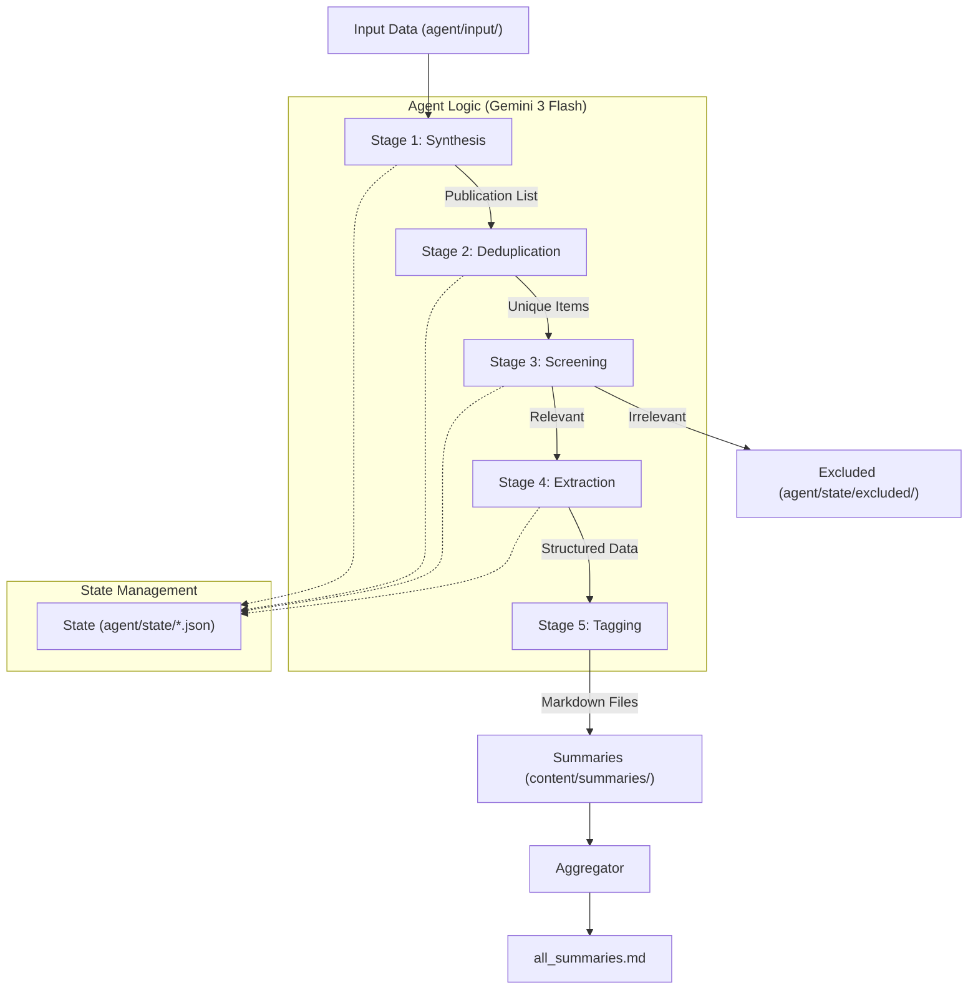

# ME/CFS Research Summaries

An automated pipeline and digital garden for processing and summarizing ME/CFS and Long COVID research. This project uses generative AI to bridge the gap between complex scientific publications and community accessibility. Visit the live site at [hanneseh.github.io/ME-CFS-Research-Summaries](https://hanneseh.github.io/ME-CFS-Research-Summaries/).

## 🛠️ Tech Stack
- **AI/LLM:** Gemini 3 Flash (`google-genai` SDK)
- **Framework:** Python 3.13+ with `asyncio` for concurrent extraction
- **Data Layer:** Pydantic for structured AI outputs and state management
- **Static Site:** [Quartz 4](https://quartz.jzhao.xyz/) (Obsidian-flavored Markdown)

## 🏗️ Technical Architecture: The Research Agent

The core of this project is a multi-stage **Research Agent** implemented in `agent/research_agent.py`. It uses structured outputs and tool calling to automate research ingestion.

### Workflow Visualization



### Pipeline Stages
1.  **Synthesis (Stage 1):** Processes messy sources (.eml, .md) into a structured list of potential publications using high-level "thinking" prompts.
2.  **Deduplication (Stage 2):** Compares new findings against existing files to ensure idempotency.
3.  **Screening (Stage 3):** Applies rigorous `inclusion_rules.md` to filter for ME/CFS-specific research.
4.  **Extraction (Stage 4):** Uses Google Search and URL context to find full texts, extracting deep metadata and generating summaries using Pydantic schemas.
5.  **Tagging (Stage 5):** Categorizes summaries based on a specialized [Research Tagging Taxonomy](agent/prompts/tagging_system.md).

## 📂 Project Structure
- `agent/`:
    - `research_agent.py`: Principal agent orchestration logic.
    - `prompts/`: Version-controlled system and input prompts.
    - `state/`: Persistent JSON state to allow safe job resumption.
- `content/summaries/`: Generated markdown summaries for the digital garden.
- `content/index.md`: The landing page of the public website.

## 🚀 Setup & Execution
1. **Install Poetry:** If not already installed, follow the [official guide](https://python-poetry.org/docs/#installation).
2. **Install dependencies:** Run `poetry install` in the project root.
3. **Configure Environment:** Create a `.env` file with your `GEMINI_API_KEY`.
4. **Input Data:** Place raw research data (.eml or .md files) in `agent/input/`.
5. **Run the Pipeline:** 
   ```bash
   poetry run python agent/research_agent.py
   ```

## 🤝 Contribution & Community
This is an open-science project. Contributions are welcome!
- **Prompts:** Improvement suggestions for the agent's screening or extraction prompts.
- **Data:** If you identify a high-value source (RSS, Newsletters), please open an issue.
- **Bugs:** Report technical pipeline issues via the GitHub Issue tracker.

## 📄 License
This project is dedicated to the public domain under the [CC0 1.0 Universal](LICENSE) license. You can copy, modify, and distribute the research summaries and code for any purpose without asking permission.

