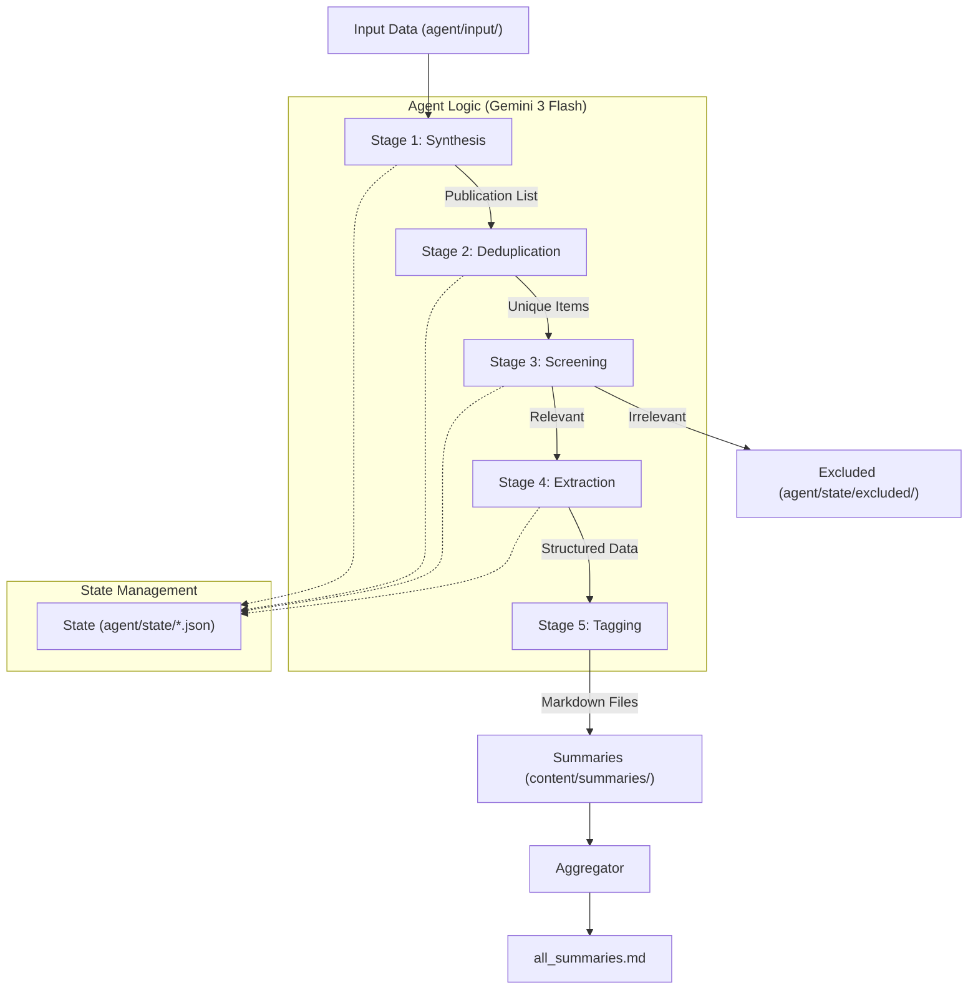

    
    <a href="https://quartz.jzhao.xyz/">
        
    
    
    
    
    

# ME/CFS Research Summaries

An automated pipeline and digital garden for processing and summarizing ME/CFS and Long COVID research. This project uses generative AI to bridge the gap between complex scientific publications and community accessibility.

## 🏗️ Technical Architecture: The Research Agent

The core of this project is a multi-stage **Research Agent** implemented in `agent/research_agent.py`. It uses structured outputs and tool calling to automate research ingestion.

### Workflow Visualization

### Pipeline Stages
1.  **Synthesis (Stage 1):** Processes messy sources (.eml, .md) into a structured list of potential publications using high-level "thinking" prompts.
2.  **Deduplication (Stage 2):** Compares new findings against existing files to ensure idempotency.
3.  **Screening (Stage 3):** Applies rigorous `inclusion_rules.md` to filter for ME/CFS-specific research.
4.  **Extraction (Stage 4):** Uses Google Search and URL context to find full texts, extracting deep metadata and generating summaries using Pydantic schemas.
5.  **Tagging (Stage 5):** Categorizes summaries based on a specialized [Research Tagging Taxonomy](agent/prompts/tagging_system.md).

## 📂 Project Structure
- `agent/`:
    - `research_agent.py`: Principal agent orchestration logic.
    - `prompts/`: Version-controlled system and input prompts.
    - `state/`: Persistent JSON state to allow safe job resumption.
- `content/summaries/`: Generated markdown summaries for the digital garden.
- `content/index.md`: The landing page of the public website.
