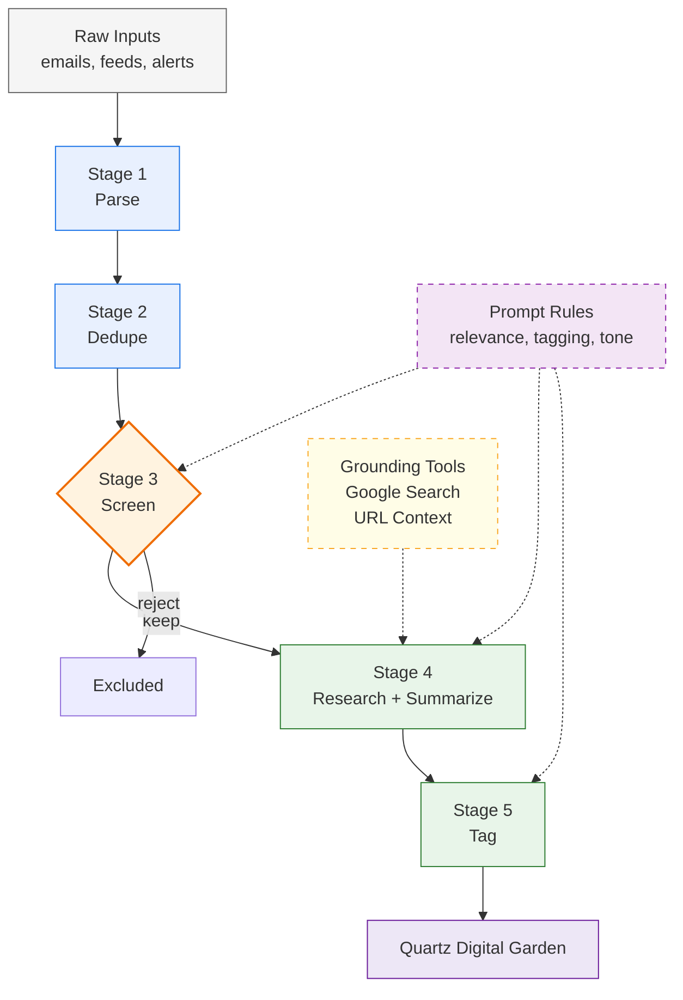

<p align="center">
  <a href="https://hanneseh.github.io/ME-CFS-Research-Summaries/">
    
  </a>
  <a href="https://quartz.jzhao.xyz/">
    
  </a>
  <a href="https://storage.googleapis.com/deepmind-media/Model-Cards/Gemini-3-Flash-Model-Card.pdf">
    
  </a>
  <a href="https://docs.pydantic.dev/">
    
  </a>
  <a href="#readme">
    
  </a>
  <a href="https://python-poetry.org/">
    
  </a>
  <a href="LICENSE">
    
  </a>
</p>

# ME/CFS Research Summaries

An automated research-curation pipeline and public digital garden for ME/CFS and closely related post-viral research.

The project is not trying to summarize everything that gets published. Its job is to reduce noise and surface the material that is most useful for patients, caregivers, and other readers who want to track real progress:

- mechanistic findings that sharpen understanding of the disease
- diagnostics and biomarkers that move the field toward testability
- treatment signals and serious trial activity
- high-signal reviews, conference updates, and research/funding momentum that help people see where the field is actually moving

## What Counts As Relevant

The curation logic is intentionally narrower than "anything biomedical" and broader than "primary studies only."

Items are favored when they help answer one or more of these questions:

- What might actually be going wrong biologically?
- What could become testable or stratifiable?
- Which therapies or trials look serious enough to watch?
- Is the field gaining real momentum, infrastructure, or institutional recognition?

Items are usually filtered out when they are mostly:

- generic patient/control biomarker associations with little directional value
- weak rehabilitation or supportive-care material
- low-plausibility alternative therapies, especially herbal or TCM-style intervention papers
- adjacent-disease analogies without a convincing bridge back to ME/CFS
- broad content that does not materially improve understanding, hope, or orientation

## Research Agent

The project uses a multi-stage AI agent to process incoming alerts and turn them into structured, public-facing summaries.


```mermaid
flowchart TD
    A["Raw Inputs<br/>emails, feeds, alerts"] --> B["Stage 1<br/>Parse"]
    B --> C["Stage 2<br/>Dedupe"]
    C --> D{"Stage 3<br/>Screen"}

    D -- keep --> E["Stage 4<br/>Research + Summarize"]
    D -- reject --> X["Excluded"]

    E --> F["Stage 5<br/>Tag"]
    F --> G["Quartz Digital Garden"]

    H["Grounding Tools<br/>Google Search<br/>URL Context"] -.-> E
    I["Prompt Rules<br/>relevance, tagging, tone"] -.-> D
    I -.-> E
    I -.-> F

    style A fill:#f5f5f5,stroke:#666,stroke-width:1px
    style B fill:#e8f0fe,stroke:#1a73e8,stroke-width:1px
    style C fill:#e8f0fe,stroke:#1a73e8,stroke-width:1px
    style D fill:#fff3e0,stroke:#ef6c00,stroke-width:2px
    style E fill:#e8f5e9,stroke:#2e7d32,stroke-width:1px
    style F fill:#e8f5e9,stroke:#2e7d32,stroke-width:1px
    style G fill:#ede7f6,stroke:#6a1b9a,stroke-width:1px
    style H fill:#fffde7,stroke:#f9a825,stroke-width:1px,stroke-dasharray: 5 5
    style I fill:#f3e5f5,stroke:#8e24aa,stroke-width:1px,stroke-dasharray: 5 5
```

| Stage     | Purpose                                                     | Notes                                                           |
| :-------- | :---------------------------------------------------------- | :-------------------------------------------------------------- |
| `Stage 1` | Extract structured publication candidates from messy alerts | email parsing, HTML cleanup, metadata extraction                |
| `Stage 2` | Remove duplicates against the existing corpus               | title/link similarity, preprint vs publication handling         |
| `Stage 3` | Decide whether an item belongs in the garden                | prompt-based screening with project-specific relevance logic    |
| `Stage 4` | Gather context and write the summary                        | grounded lookup, structured extraction, patient-facing framing  |
| `Stage 5` | Apply taxonomy tags                                         | `⭐ Landmark`, `💊 Treatment`, `🧪 Biomarker`, `⏳ Trial`, `📰 News` |

All intermediate runtime state is persisted to `agent/state/`, which makes the pipeline resumable and practical to operate on real alert batches.

## Retrospective Relevance Audit

Existing summaries can be re-screened against the current relevance criteria with:

```bash
poetry run python agent/relevance_audit_agent.py
```

The audit writes local review artifacts to `.agent/relevance_audits/<timestamp>/`, including:

- `audit_report.md` for human review
- `relevance_spectrum.csv` for sorting and filtering scores
- `results/*.json` with one structured Gemini decision per summary
- `delete_recommended.sh` with `git rm` commands for summaries Gemini recommends removing

Use `--limit` for a small test run, `--concurrency` to control parallel API calls, and `--run-dir` to resume an interrupted audit without re-running completed items.

## Project Structure

- `agent/research_agent.py`
  - main orchestration for the multi-stage pipeline
- `agent/relevance_audit_agent.py`
  - retrospective relevance audit for the existing summary corpus
- `agent/prompts/`
  - version-controlled prompts for screening, summarization, and tagging
- `content/summaries/`
  - the canonical summary corpus used by the website
- `content/index.md`
  - landing page for the public digital garden
- `quartz/`, `quartz.config.ts`, `quartz.layout.ts`
  - static site generation and presentation layer
- `public/`
  - built site output, excluded from Git

## Operating Model

The agent is designed around a few practical constraints:

- incoming research alerts are noisy
- relevance is partly scientific and partly community-facing
- evidence strength varies widely and needs to be communicated honestly
- "progress" is not only new data, but also serious trial activity, infrastructure, and coordinated research effort

That means the system combines:

- structured prompts
- explicit inclusion/exclusion rules
- grounded lookup during summarization
- manual feedback loops when curation preferences become clearer through review
