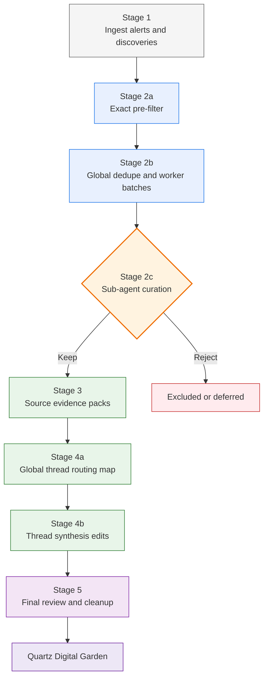

<p align="center">
  <a href="https://hanneseh.github.io/ME-CFS-Research-Summaries/">
    
  </a>
  <a href="https://quartz.jzhao.xyz/">
    
  </a>
  <a href="https://storage.googleapis.com/deepmind-media/Model-Cards/Gemini-3-Flash-Model-Card.pdf">
    
  </a>
  <a href="https://docs.pydantic.dev/">
    
  </a>
  <a href="#readme">
    
  </a>
  <a href="https://python-poetry.org/">
    
  </a>
  <a href="LICENSE">
    
  </a>
</p>

# ME/CFS Research Summaries

A thread-first public digital garden for ME/CFS and closely related post-viral research.

The project is not trying to summarize everything that gets published. Its job is to reduce noise and surface the material that is most useful for patients, caregivers, and other readers who want to track real progress:

- mechanistic findings that sharpen understanding of the disease
- diagnostics and biomarkers that move the field toward testability
- treatment signals and serious trial activity
- high-signal reviews, conference updates, and research/funding momentum that help people see where the field is actually moving

## What Counts As Relevant

The curation logic is intentionally narrower than "anything biomedical" and broader than "primary studies only."

Items are favored when they help answer one or more of these questions:

- What might actually be going wrong biologically?
- What could become testable or stratifiable?
- Which therapies or trials look serious enough to watch?
- Is the field gaining real momentum, infrastructure, or institutional recognition?

Items are usually filtered out when they are mostly:

- generic patient/control biomarker associations with little directional value
- weak rehabilitation or supportive-care material
- low-plausibility alternative therapies, especially herbal or TCM-style intervention papers
- adjacent-disease analogies without a convincing bridge back to ME/CFS
- broad content that does not materially improve understanding, hope, or orientation

## Current Site Model

The public site is organized around living research threads. A thread is a topic page for one treatment direction, disease mechanism, diagnostic theme, symptom/care question, or field-momentum cluster.

Thread pages live at:

```text
content/<thread-group>/<thread-slug>/index.md
```

Current thread groups:

- `content/treatments-interventions/`
- `content/disease-models-mechanisms/`
- `content/diagnostics-symptoms-care/`

Do not add a catch-all miscellaneous thread unless the content model is deliberately changed again. New research should either update an existing thread or justify a new dedicated thread.

Each thread page should include frontmatter like:

```yaml
---
title: Example Thread
description: A living thread on ...
date: YYYY-MM-DD
last_updated: YYYY-MM-DD
thread_status: active
evidence_level: early clinical
primary_topics:
  - Treatment
cssclasses: [thread-page]
---
```

The `date` and `last_updated` fields must both match the newest dated event in that thread's `Timeline`. Quartz uses `date` for visible page metadata, while the homepage thread index uses `last_updated` for sorting.

## Homepage Mechanics

The homepage lives at `content/index.md`. It contains a marker:

```text
THREAD_INDEX_PLACEHOLDER
```

The local Quartz page-type plugin in `plugins/thread-index/` replaces that marker at render time with a list of all thread pages sorted by `last_updated` in reverse chronological order.

Important constraints:

- A page appears in the homepage list only if it is an `index.md` page with `thread_status` and `last_updated` frontmatter.
- The plugin reads Quartz `allFiles` metadata during rendering, so the list updates automatically when thread frontmatter changes.
- The plugin entrypoint is `plugins/thread-index/index.js`. Do not move it to `dist/` unless `.gitignore` is adjusted, because repo-wide `dist/` paths are ignored.

## Graph View Mechanics

The graph component comes from the local plugin in `plugins/graph/`, enabled through `quartz.config.yaml`.

Preserve these details:

- `content-index` must remain enabled in `quartz.config.yaml`; graph data comes from `static/contentIndex.json`.
- Homepage graph routing must treat slug `index` as the site root, not `/index/`.
- The homepage thread list is injected after the content index is generated, so those links are not visible to `contentIndex.json` automatically.
- To keep the homepage graph useful, `plugins/graph/src/components/scripts/graph.inline.ts` synthesizes edges from `index` to every thread page slug at render time.
- After editing graph source code, run `npm run build` inside `plugins/graph/` so the tracked `dist/` bundle used by Quartz is updated.

The local graph depth is configured in `quartz.config.yaml`. Keep it shallow unless there is a specific reason to show second-degree neighbours; depth `1` is the current intended behavior.

## Updating A Thread

When adding new research:

1. Decide whether the source updates an existing thread or needs a new dedicated thread.
2. Add a dated `Timeline` entry using the source publication, registry, preprint, conference, or announcement date.
3. Update `Current Takeaway`, `State of Evidence`, `Open Questions`, and `Related Threads` only where the new source changes the synthesis.
4. Set both `date` and `last_updated` to the newest timeline date.
5. Add or update links in the relevant thread-group index page.
6. Run validation:

```bash
npx tsc --noEmit
npx quartz build --baseDir /ME-CFS-Research-Summaries
```

If graph source code changed:

```bash
cd plugins/graph
npm run build
cd ../..
npx quartz build --baseDir /ME-CFS-Research-Summaries
```

## Thread-First Ingress Workflow


```mermaid
flowchart TD
    Ingest["Stage 1<br/>Ingest alerts and discoveries"] --> Pre["Stage 2a<br/>Exact pre-filter"]
    Pre --> Dedupe["Stage 2b<br/>Global dedupe and worker batches"]
    Dedupe --> Curate{"Stage 2c<br/>Sub-agent curation"}
    Curate -- Keep --> Packs["Stage 3<br/>Source evidence packs"]
    Curate -- Reject --> Ex["Excluded or deferred"]
    Packs --> Map["Stage 4a<br/>Global thread routing map"]
    Map --> Threads["Stage 4b<br/>Thread synthesis edits"]
    Threads --> Review["Stage 5<br/>Final review and cleanup"]
    Review --> Quartz["Quartz Digital Garden"]

    style Ingest fill:#f5f5f5,stroke:#666,stroke-width:1px
    style Pre fill:#e8f0fe,stroke:#1a73e8,stroke-width:1px
    style Dedupe fill:#e8f0fe,stroke:#1a73e8,stroke-width:1px
    style Curate fill:#fff3e0,stroke:#ef6c00,stroke-width:2px
    style Packs fill:#e8f5e9,stroke:#2e7d32,stroke-width:1px
    style Map fill:#e8f5e9,stroke:#2e7d32,stroke-width:1px
    style Threads fill:#e8f5e9,stroke:#2e7d32,stroke-width:1px
    style Review fill:#f3e5f5,stroke:#7b1fa2,stroke-width:1px
    style Ex fill:#ffebee,stroke:#c62828,stroke-width:1px
    style Quartz fill:#ede7f6,stroke:#6a1b9a,stroke-width:1px
```

The current ingress system is local, staged, and thread-first. Codex coordinates
the run, deterministic Python scripts prepare bounded artifacts, and
Antigravity/Gemini worker sessions handle token-intensive reading, clustering,
and synthesis. The public source of truth is always the living thread Markdown
under `content/`, not the temporary state files produced during an import run.

| Stage | Purpose | Primary files |
| :--- | :--- | :--- |
| `Stage 1` | Fetch unread email alerts, Reddit/RSS items, YouTube channel uploads, and manual URLs | `agent-cli/ingress.py`, `agent-cli/input/` |
| `Stage 2a` | Extract existing citations and remove exact duplicates | `agent-cli/scripts/extract_inventory.py`, `agent-cli/scripts/pre_filter.py` |
| `Stage 2b` | Normalize candidates, cluster globally, and emit worker batches | `agent-cli/scripts/stage_2_prepare.py` |
| `Stage 2c` | Use bounded worker sessions to screen relevance, resolve wrappers, and map candidate clusters to valid thread slugs | `agent-cli/scripts/consolidate_worker_reviews.py` |
| `Stage 3` | Create source-level evidence packs for retained sources | `agent-cli/state/evidence_packs/` during a run |
| `Stage 4` | Build a global thread routing map, then update public thread pages by thread or thread family | `content/**/index.md` |
| `Stage 5` | Review diffs, run the Quartz build, delete transient run state, and publish | `.gitignore`, `npm run build` |

`agent-cli/state/` is intentionally ignored. It is scratch/audit state for a
single ingress run and can be deleted after the reviewed material has been
folded into public thread pages.

## Project Structure

- `agent-cli/`
  - thread-first local ingress workspace, deterministic helper scripts, and
    machine-readable thread rules
- `agent-cli/ingress.py`
  - unified command for email, Reddit/RSS, YouTube, and manual source intake
- `agent-cli/scripts/`
  - deterministic helpers for inventory extraction, pre-filtering, Stage 2
    preparation, worker-review consolidation, and YouTube transcript checks
- `agent-cli/state/`
  - ignored transient run state; delete after a completed and reviewed import
- `content/<thread-group>/<thread-slug>/index.md`
  - public living research thread pages
- `content/index.md`
  - landing page for the public digital garden; includes the thread-index marker replaced during render
- `plugins/thread-index/`
  - local Quartz plugin that renders the homepage's reverse-chronological thread list from frontmatter
- `plugins/graph/`
  - local Quartz graph plugin; includes homepage-specific graph-link handling
- `quartz/`, `quartz.config.yaml`, `quartz.ts`
  - static site generation and presentation layer
- `public/`
  - built site output, excluded from Git


## Operating Model

The agent is designed around a few practical constraints:

- incoming research alerts are noisy
- relevance is partly scientific and partly community-facing
- evidence strength varies widely and needs to be communicated honestly
- "progress" is not only new data, but also serious trial activity, infrastructure, and coordinated research effort

That means the system combines:

- structured prompts
- explicit inclusion/exclusion rules
- grounded lookup during summarization
- manual feedback loops when curation preferences become clearer through review
