    
    <a href="https://quartz.jzhao.xyz/">
        
    
    
    
    
    

# ME/CFS Research Summaries

An automated pipeline and digital garden for processing and summarizing ME/CFS and Long COVID research. This project uses generative AI to bridge the gap between complex scientific publications and community accessibility.

## 🤖 How the Research Agent Works

This project uses a multi-stage AI agent to process research alerts. Each stage is a distinct Gemini API call with a specialized system prompt, Pydantic-enforced output schemas, and persistent state for fault-tolerant resumption.

```mermaid
flowchart LR
    subgraph Ingestion
        A["📧 Raw Input<br/>(Emails, Feeds)"]
    end

    subgraph Pipeline["Agent Pipeline (Gemini 3 Flash)"]
        direction LR
        S1["Stage 1<br/>Parse"] --> S2["Stage 2<br/>Dedupe"]
        S2 --> S3{"Stage 3<br/>Screen"}
        S3 -- Relevant --> S4["Stage 4<br/>Summarize"]
        S3 -- Excluded --> X["❌"]
        S4 --> S5["Stage 5<br/>Tag"]
    end

    subgraph Tools["Agentic Tools"]
        T1["🌍 Google Search"]
        T2["🔗 URL Context"]
    end

    subgraph Output
        O["🌿 Digital Garden<br/>(Quartz)"]
    end

    A --> S1
    S4 <-. grounding .-> Tools
    S5 --> O

    style Pipeline fill:#e1f5fe,stroke:#01579b,stroke-width:2px
    style Tools fill:#fffde7,stroke:#f9a825,stroke-width:1px,stroke-dasharray: 5 5
```

| Stage            | Purpose                                                               | Key Features                          |
| :--------------- | :-------------------------------------------------------------------- | :------------------------------------ |
| **1. Parse**     | Extracts structured paper metadata from raw email/feed data.          | EML/HTML parsing, `BeautifulSoup`     |
| **2. Dedupe**    | Compares new items against the existing corpus to prevent duplicates. | Fuzzy title matching                  |
| **3. Screen**    | Applies strict inclusion/exclusion criteria for ME/CFS relevance.     | Rule-based prompt, `is_relevant` flag |
| **4. Summarize** | Deep-dives into the paper using grounded tools.                       | **Google Search**, **URL Context**    |
| **5. Tag**       | Applies a consistent taxonomy to the final summary.                   | Version-controlled tagging schema     |

All intermediate state is persisted to `agent/state/`, making the pipeline **idempotent and resumable**.

## 📂 Project Structure
- `agent/`:
    - `research_agent.py`: Principal agent orchestration logic.
    - `prompts/`: Version-controlled system and input prompts.
    - `state/`: Persistent JSON state to allow safe job resumption.
- `content/summaries/`: Generated markdown summaries for the digital garden.
- `content/index.md`: The landing page of the public website.
